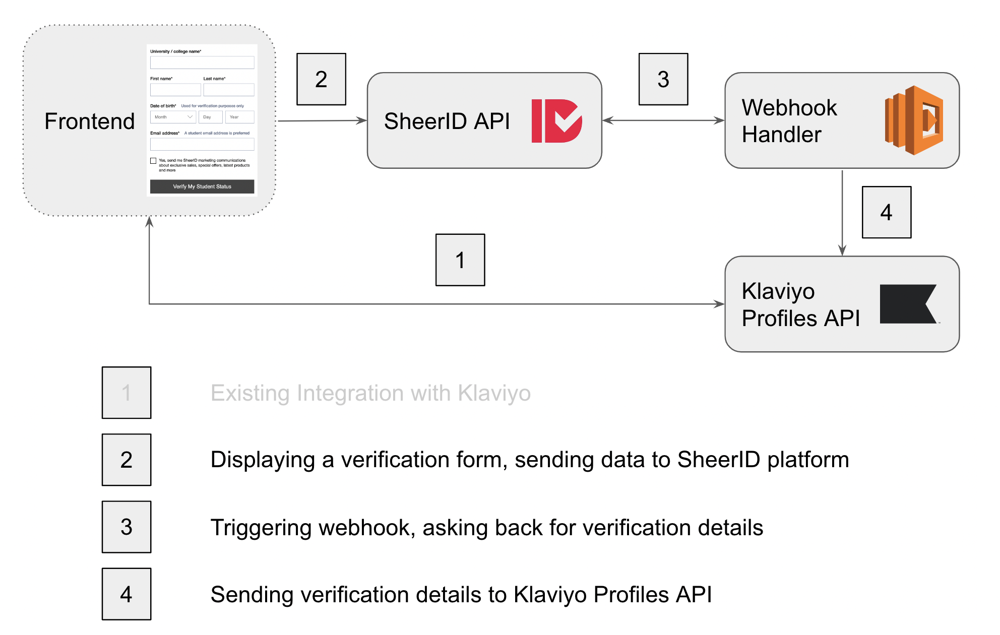
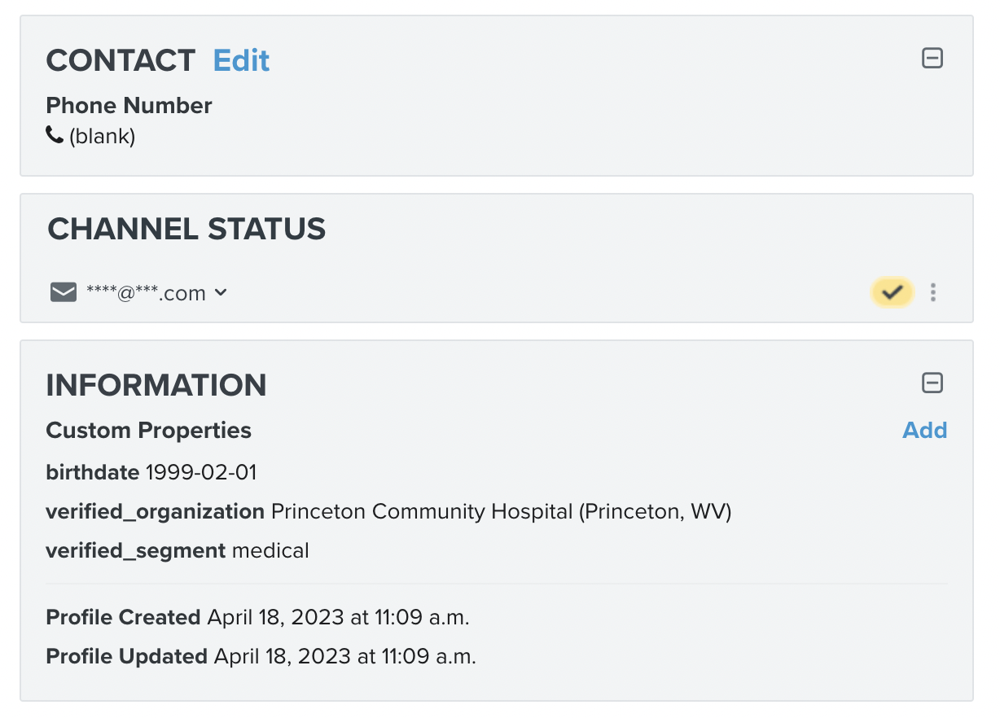

# SheerID - Klaviyo Integration demo

This serverless webhook handler demonstrates how to handle SheerID webhook payload and create or update a Klaviyo profile object. The demo is not useful without integration with a frontend already integrated with Klaviyo. 

## Architecture

This integration is connecting SheerID verification with Klaviyo, marketing automation platform for email and sms.

The integration is receiving a webhook from SheerID verification and using the [SheerID API v2](https://developer.sheerid.com/) for getting verification details.
Using the verification details the webhook handler is using the [Klaviyo Profile API](https://developers.klaviyo.com/en/reference/get_profiles) for finding / updating or creating a dummy profile to showcase a possible integration scenario.



## Deploying the webhook handler to AWS Lambda

Make sure you have Node, [serverless](https://www.npmjs.com/package/serverless), [pnpm](https://pnpm.io/) (or npm, yarn) and configured AWS credentials with permissions to create AWS lambda functions.
If you don't have sls, install it with:

```sh
$ pnpm i -g serverless
```

After configuring the .env file, deploy the webhook handler to AWS Lambda with the following commands:

```sh
$ pnpm i
$ pnpm run deploy
```

Make note the endpoint url, you will need it later.

### Environment variables for the webhook handler

Set environment variables for the created AWS lambda function with the following values:

```sh
SHEERID_ACCESS_TOKEN=Access Token from SheerID dashboard (settings -> access tokens)
KLAVIYO_PRIVATE_API_KEY=API Key from Klaviyo dashboard (account (bottom left) -> settings -> api keys -> create private API key)
```

> **_NOTE:_** If you don't have access to SheerID Access Tokens tab, modify your user in Settings -> Team and add "API Access" to your user, log out and log back in.

## Configuring SheerID system

### Create a new verification program

Create a new verification program in SheerID. You can use the following settings:
- Segment: students
- Program Type: no code
- Program Name: Klaviyo demo
- Publish: new page (copy the url and save it for later)
- Test mode on (so you can test the integration without real verifications)

After saving the program, go to settings, add a webhook for successful verifications in a format https://{your-aws-lambda-endpoint-url}/success-webhook, test if the handler working by loading https://{your-aws-lambda-endpoint-url}/ in a browser.

## Frontend

As a recommendation, the Klaviyo frontend integration should send cart details, identified by a unique session identifier to Klaviyo, as a separate payload, and the verification form should update this session with the verified attribute values. To achieve this, the session identifier can be added to the SheerID verification form as metadata, the webhook handler will get the metadata as part of the verification details and can update the session in Klaviyo API using this value.

# Dummy serverless webhook handler

As the frontend integration was not part of the demo, our serverless function is filtering Klaviyo profiles to find the profile by email, updating or adding a profile with verified properties values and birthdate.

## Testing the integration

To test the integration, you can use the following steps:
- load the landing page url (that you copied from the SheerID dashboard publish step)
- fill in the form and submit
- check the Klaviyo dashboard, the profile should be in the Audience section with the verified properties values and birthdate.


