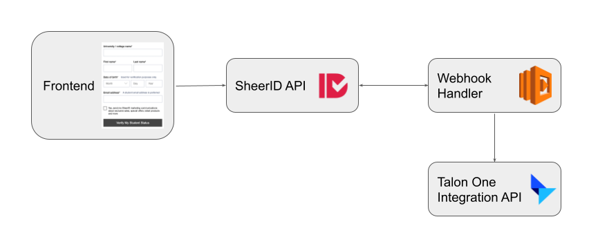
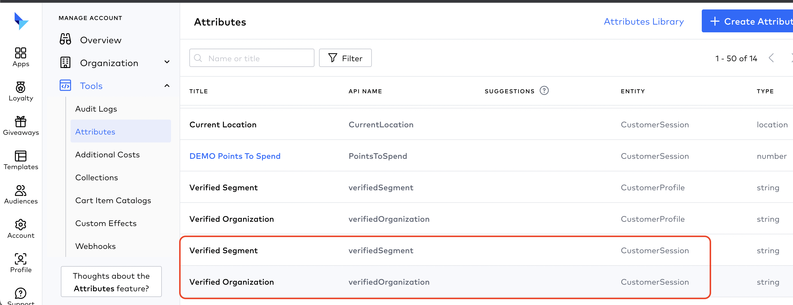
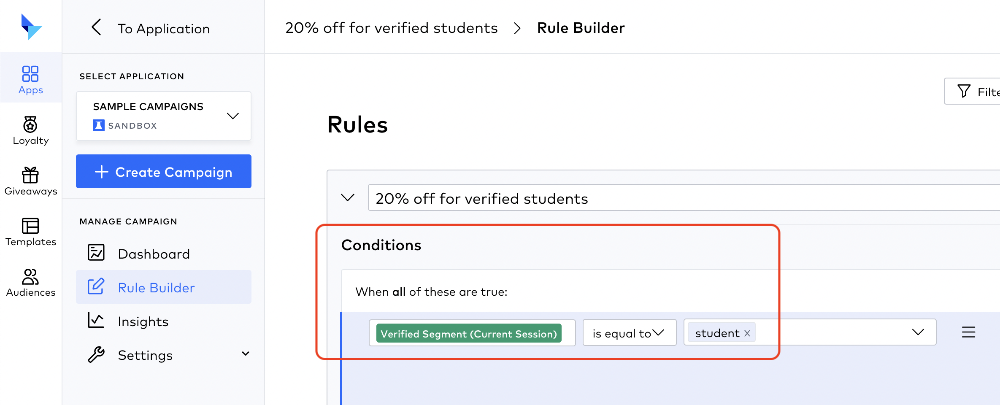
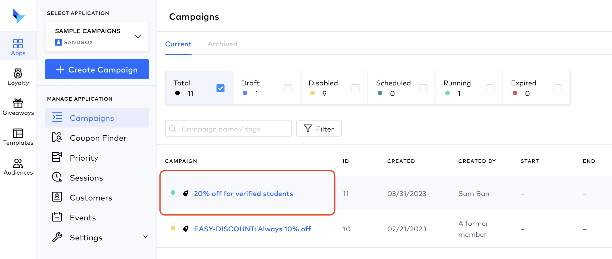
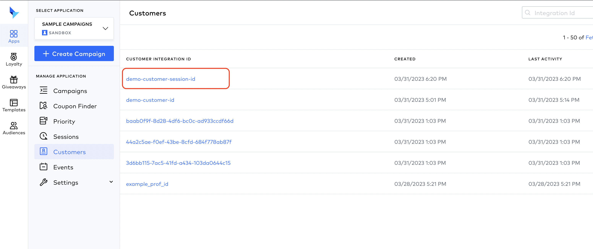
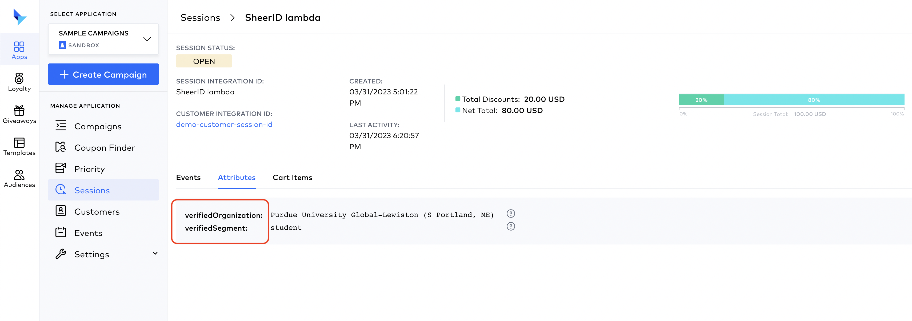

# Talon One integration

This integration is connecting SheerID verification with Talon One, a loyalty and rewards platform. The integration is using the [Talon One Management API](https://developers.talon.one/Management-API/) for creating the necessary attributes, [Talon One Integration API](https://developers.talon.one/Integration-API/) for pushing a dummy customer session to showcase a possible integration scenario.

The integration is receiving a webhook from SheerID verification and using the [SheerID API v2](https://developer.sheerid.com/) for getting verification details.

## Architecture



## Deploying the webhook handler to AWS Lambda

Make sure you have Node, [serverless](https://www.npmjs.com/package/serverless), [pnpm](https://pnpm.io/) (or npm) and configured AWS credentials with permissions to create AWS lambda functions.
If you don't have sls, install it with:

```sh
$ pnpm i -g serverless
```

After configuring the .env file, deploy the webhook handler to AWS Lambda with the following commands:

```sh
$ cd webhook
$ pnpm i
$ pnpm run deploy
```

Make note the endpoint url, you will need it later.

### Environment variables for the webhook handler

In `webhook/` folder, use .env.example not to create an .env file but to set environment variables for the created AWS lambda function.

```sh
SHEERID_ACCESS_TOKEN=Access Token from SheerID dashboard (settings -> access tokens)
TALON_ONE_API_KEY=API Key from Talon One dashboard (campaign -> tools -> developer settings)
TALON_ONE_BASEPATH=your talon one url, for example https://sheerid.us-east4.talon.one
```

> **_NOTE:_** If you don't have access to SheerID Access Tokens tab, modify your user in Settings -> Team and add "API Access" to your user, log out and log back in.

## Configuring SheerID system

### Create a new verification program

Create a new verification program in SheerID. You can use the following settings:
- Segment: students
- Program Type: no code
- Program Name: Talon One
- Publish: new page (copy the url and save it for later)
- Test mode on (so you can test the integration without real verifications)

After saving the program, go to settings, add a webhook for successful verifications in a format https://{your-aws-lambda-endpoint-url}/success-webhook, test if the handler working by loading https://{your-aws-lambda-endpoint-url}/ in a browser.

### Run tooling to create attributes in Talon One

In the main repository folder, edit the .env file and fill in the values.

```sh
SHEERID_ACCESS_TOKEN=your-access-token-from-sheerid-dashboard
SHEERID_API_URL=https://services.sheerid.com/rest/v2/
TALON_ONE_ADMIN_EMAIL="youradmin@email"
TALON_ONE_PASSWORD="yourpassword"
TALON_ONE_BASEPATH="https://{your-talonone-url}.us-east4.talon.one"
```

```sh
$ pnpm i
$ pnpm run create-attributes
```

You should see the created attributes as JSON output, and in Talon One dashboard the account attributes accordingly.



## Frontend

As a recommendation, the Talon One frontend integration should send cart details, identified by a unique session identifier to Talon One, as a separate payload, and the verification form should update this session with the verified attribute values. To achieve this, the session identifier can be added to the SheerID verification form as metadata, the webhook handler will get the metadata as part of the verification details and can update the session in Talon One API using this value.

# Dummy serverless webhook handler

As the frontend integration was not part of the demo, our serverless function in the `webhook/` folder is creating a hardcoded demo session id, pushing dummy cart data and adding the verified attribute values to the session.

## Configuring a demo promotion in Talon One

To showcase the integration, we are creating a demo promotion in Talon One, which will be triggered by the verified attribute values.

In Talon One rule builder, create a new rule with the following settings:





The rule will be triggered by the verified attribute values, and will add a discount to the cart. The frontend integration will take care of updating the cart and showing the discount, this is not part of the demo.

## Testing the integration

To test the integration, you can use the following steps:
- load the landing page url (that you copied from the SheerID dashboard publish step)
- fill in the form and submit
- check the Talon One dashboard, the demo session should be updated with the verified attribute values, and the promotion should be triggered



Verification details should be visible in the session's attributes:




